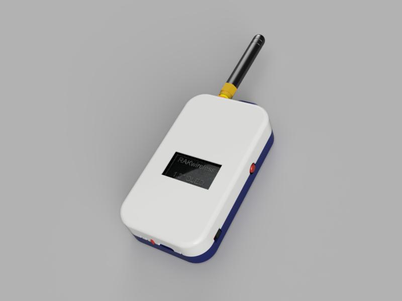
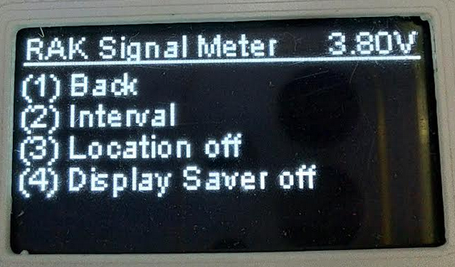
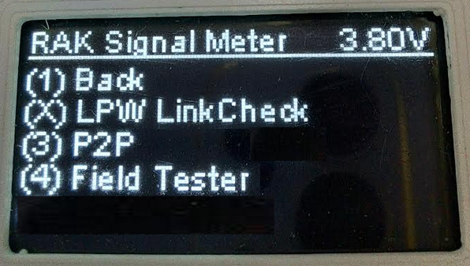
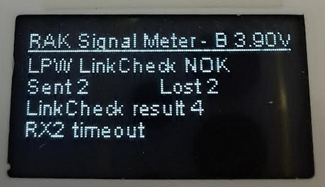
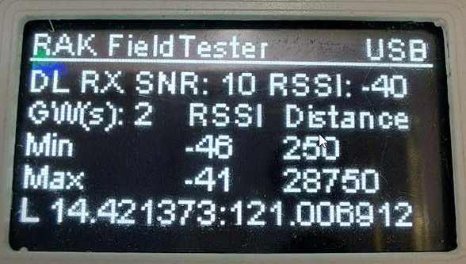
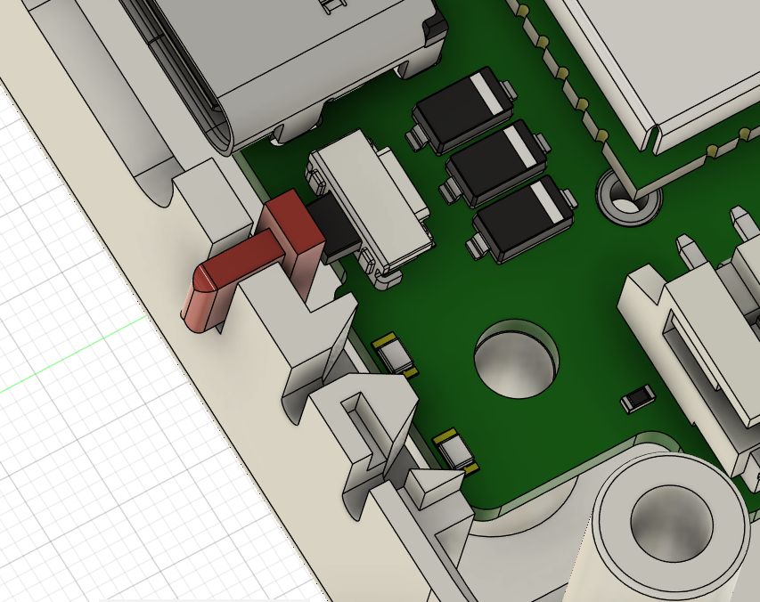

# Simple RUI3 based Signal Meter with settings option
|  |      |  |    
| :-: | :-: | :-: |

----

#### ⚠️ IMPORTANT ⚠️        
This firmware requires at least RUI3 V4.1.1 or newer.

----

# Content
- [Overview](#overview)
- [Hardware](#hardware)
- [Setup with built-in UI](#setup-with-built-in-ui)
- [Setup with AT commands](#setup-with-at-commands)
  - [LoRa P2P](#lora-p2p-setup)
  - [LoRaWAN confirmed packets](#lorawan-confirmed-packets-setup)
  - [LoRaWAN LinkCheck](#lorawan-linkcheck-setup)
  - [LoRaWAN Field Tester (requires backend server)](#lorawan-field-tester-setup)
- [Usage](#usage)
  - [LoRa P2P](#lora-p2p)
  - [LoRaWAN confirmed packets](#lorawan-confirmed-packets)
  - [LoRaWAN LinkCheck](#lorawan-linkcheck)
  - [LoRaWAN Field Tester (requires backend server)](#lorawan-field-tester)
- [Enclosure](#enclosure)
- [Firmware](#firmware)

----

# Overview

This is a PoC of a very basic signal tester. It works in both LoRa P2P and LoRaWAN mode. It uses a simple OLED display and a simple one-button controlled UI for settings changes. All settings can be done as well over USB with RUI3 AT commands.    
It is a very simple (~30 US$ cheap) device that can help to check LoRa and LoRaWAN coverage. It does not claim to be a super precise instrument, it is just an affordable small instrument to check signal coverage.    
The difference to the "other" _**Simple RUI3 based Signal Meter**_ is that this version is designed for use with the new RAK19026 Base Board with a larger OLED display and a pre-installed user button.

<center>&nbsp&nbsp&nbsp&nbsp</center>

#### ⚠️ INFO ⚠️        
One of the advantages of this simple tester is that it does not require any backend installations on the LoRaWAN server (like Helium, TTN and Chirpstack) if used in LinkCheck and Confirmed Packet mode, but should work with any LoRaWAN server like AWS or Actility.     
Only the Field Tester Mode requires a backend server.    

## LoRa P2P mode
If used in LoRa P2P, it is listening on the selected LoRa P2P settings and sending packets on the same settings:
- Frequency
- Bandwidth
- Spreading Factor
- Coding Rate
- Preample Length  

If a packet is received on above settings, it will display the information on the OLED screen. To use it for a specific P2P scenario, it will require adaption in the code, like recognizing packets, send out specific test packets to other LoRa P2P nodes.

## LoRaWAN mode
If used in LoRaWAN mode, the device is connecting to a LoRaWAN server and sends out frequently a data packet. 
It requires setup of the devices with its LoRaWAN credentials and register on a LoRaWAN server with
- DevEUI
- AppEUI
- AppKey
- OTAA join mode
- LoRaWAN region

It uses either confirmed packet mode or LinkCheck to collect information about the connection to the gateway(s).    
If used with confirmed packets, it will display the RSSI and SNR of the ACK packet received from the LoRaWAN server.    
If used with LinkCheck, the LoRaWAN server will report the number of gateways and the demodulation margin (calculated on the LoRaWAN server). The demodulation margin can give you information about the received signal quality.    
Extract from the _**LoRaWAN 1.0.3 Specification**_:
<center></center>

In addition, it supports the RAK10701 Field Tester protocol. The advantage of the Field Tester protocol is that it provides more information about the test, including distances to the gateways. The disadvantage is that this protocol requires a backend server to process the information and send it back to the device.

This examples includes three custom AT commands:     
- **`ATC+SENDINT`** to set the send interval time or heart beat time. The device will send a payload with this interval. The time is set in seconds, e.g. **`AT+SENDINT=600`** sets the send interval to 600 seconds or 10 minutes.    
- **`ATC+MODE`** to set the test mode. 0 using LPWAN LinkCheck, 1 using LPWAN CFM, 2 using LoRa P2P, 3 using Field Tester protocol.
- **`ATC+STATUS`** to get some status information from the device.    
- **`ATC+PCKG`** to setup a custom payload that is used in the uplink packets.

[Back to top](#content)

----

# Hardware
The device is built with a custom WisBlock Base Board:
- [WisBlock Base Board RAK19026 (WisMesh Base Board) (coming soon)](https://store.rakwireless.com/products/wisblock-base-board-rak19026)

To extend lifetime of the device, the battery can be disconnected by a simple slider switch. This helps to avoid discharging the battery while the device is not in use. But to charge the battery, the device has to be switched on!

The RAK19026 Base Board features as well a user configurable button, in this case it is used to control the UI, enable/disable the display and reset the device.

[Back to top](#content)

----

# Setup with built-in UI

Most of the parameters (not all) can be changed with the built-in UI.     
The UI has several levels, the navigation between the levels and selection of items is done with the single user button of the device.    

## Generic function of the button if the Settings UI is not active:

### Single click
==> no function

### Double click
==> enter the Settings UI (stops the testing mode, no more test packets are sent and received packets are ignored)

### Tripe click
==> Force a downlink packet to be sent

### 4 clicks
==> Reset the device

### 5 clicks
==> Enter Bootloader Mode

### Long Press
==> switch off / on the display for power savings

## Function of the button if the Settings UI is active

The button function in the Settings UI changes, depending on the settings level. In general, a single click goes up one level in the settings.     
For other items, the number in front of the item indicates the number of clicks required to activate the level.    
If a level has selectable items, the selected items is marked with _**`(X)`**_ instead of its number.    
If a level has an item that can be toggled on/off, the status is shown after the item name.    

Overview of all settings levels and button functions:

| Level | Sub Level 1 | Sub Level 2 | Comment |
| ----- | ---------- | ---------- |------- |
| Top level<br> | | | Device might reset on leaving the settings if test mode has changed. |
| | Device Info <br> | | Current test settings |
| | Device Settings <br> | | General settings<br> Location and Display Saver are on/off toggle items |
| | | Send Interval <br> | Change send interval in 15 second steps<br>(2) 15 seconds more<br>(3) 15 seconds less |
| | Mode <br> | | Exclusive selection of one mode by number of clicks |
| | LoRa Settings (LoRaWAN test modes) <br> | | UI depends on selected test mode.<br> In LinkCheck, Confirmed Packet and Field Tester Mode, it shows LoRaWAN specific settings. |
| | | ADR on/off<br> | Switch ADR on or off |
| | | DR selection<br> | Change DR setting<br> (2) next higher DR<br>(3) next lower DR |
| | | TX Power selection<br> | Change TX power setting<br> (2) next higher TX power<br>(3) next lower TX power |
| | | LoRaWAN region selection<br> | Change LoRaWAN region setting<br> (2) next region<br>(3) previous region |
| | LoRa Settings (LoRa P2P test mode) <br> | | UI depends on selected test mode.<br> In LoRa P2P Mode, it shows LoRa P2P specific settings. |
| | | Frequency change<br> | Change send/receive frequency<br>(2) 0.1MHz up<br>(3) 0.1MHz down<br>For larger changes, it is recommended to use the AT commands. |
| | | SF change<br> | Change Spreading Factor<br>(2) next SF<br>(3) previous SF<br>For larger changes, it is recommended to use the AT commands. |
| | | BW change<br> | Change Bandwidth<br>(2) next BW<br>(3) previous BW |
| | | CR change<br> | Change Coding Rate<br>(2) next CR<br>(3) previous CR |
| | | TX power change<br> | Change Transmission Power<br>(2) next TX level <br>(3) previous TX level |


----

# Setup with AT commands

## LoRa P2P Setup

To use the device in LoRa P2P mode it has to be set into this mode with     
```at
AT+NWM=0
```
The device might reboot after this command, if it was not already in P2P mode.    
Then the LoRa P2P parameters have to be setup. In this example, I am setting the device to 916100000 Hz frequency, 125kHz bandwidth, spreading factor 7, coding rate 4/5, preamble length 8 and TX power of 5dBm:

```at
AT+PRECV=0
AT+P2P=916000000:7:0:1:8:5
ATC+MODE=2
```

#### ⚠️ TIP ⚠️ 
If the credentials were set already (they are saved in the flash of the device), the switch to P2P testing can as well be done with
```at
ATC+MODE=2
```
The device might reboot after this command, if it was not already in LoRa P2P mode.    


#### ⚠️ TIP ⚠️        
The command _**`AT+PRECV=0`**_ is _**required**_ to stop the device from listening. While in RX mode, parameters cannot be changed.

To be able to receive packets from other devices, they have to be setup to exactly the same parameters.

[Back to top](#content)

----

## LoRaWAN Confirmed Packets Setup

To use the device in LoRaWAN mode it has to be set into this mode with     
```at
AT+NWM=1
```
The device might reboot after this command, if it was not already in LoRaWAN mode.    
Then the LoRaWAN parameters and credentials have to be setup. In this example, I am setting the device to AS923-3, OTAA join mode, confirmed packet mode, disable link check and then reset the device to perform a LoRaWAN JOIN sequence:

```at
AT+BAND=10
AT+NJM=1
AT+CFM=1
AT+LINKCHECK=0
AT+DEVEUI=AC1F09FFFE000000
AT+APPEUI=AC1F09FFFE000000
AT+APPKEY=AC1F09FFFE000000AC1F09FFFE000000
ATC+MODE=1
ATZ
```

#### ⚠️ TIP ⚠️ 
If the credentials were set already (they are saved in the flash of the device), the switch to CFM testing can as well be done with
```at
ATC+MODE=1
```
The device might reboot after this command, if it was not already in LoRaWAN mode.    

#### ⚠️ IMPORTANT ⚠️        
The device has to be registered in a LoRaWAN server with these credentials and a gateway in range has to be connected to the LoRaWAN server. Otherwise the device cannot join and there are no tests possible!
If the device cannot join the network, it will show an error on the display:

<center></center>

In this case double check all settings on the device and LoRaWAN server and check if a gateway is in range and connected to the LoRaWAN server.

[Back to top](#content)

----

## LoRaWAN LinkCheck Setup

To use the device in LoRaWAN mode it has to be set into this mode with     
```at
AT+NWM=1
```
The device might reboot after this command, if it was not already in LoRaWAN mode.    
Then the LoRaWAN parameters and credentials have to be setup. In this example, I am setting the device to AS923-3, OTAA join mode, unconfirmed packet mode, enable link check and then reset the device to perform a LoRaWAN JOIN sequence:

```at
AT+BAND=10
AT+NJM=1
AT+CFM=0
AT+LINKCHECK=2
AT+DEVEUI=AC1F09FFFE000000
AT+APPEUI=AC1F09FFFE000000
AT+APPKEY=AC1F09FFFE000000AC1F09FFFE000000
ATC+MODE=0
ATZ
```

#### ⚠️ TIP ⚠️ 
If the credentials were set already (they are saved in the flash of the device), the switch to LinkCheck testing can as well be done with
```at
ATC+MODE=0
```
The device might reboot after this command, if it was not already in LoRaWAN mode.    

#### ⚠️ IMPORTANT ⚠️        
The device has to be registered in a LoRaWAN server with these credentials and a gateway in range has to be connected to the LoRaWAN server. Otherwise the device cannot join and there are no tests possible!
If the device cannot join the network, it will show an error on the display:

<center></center>

In this case double check all settings on the device and LoRaWAN server and check if a gateway is in range and connected to the LoRaWAN server.

[Back to top](#content)

----

## LoRaWAN Field Tester Setup

To use the device in LoRaWAN mode it has to be set into this mode with     
```at
AT+NWM=1
```
The device might reboot after this command, if it was not already in LoRaWAN mode.    
Then the LoRaWAN parameters and credentials have to be setup. In this example, I am setting the device to AS923-3, OTAA join mode, confirmed packet mode, disable link check and then reset the device to perform a LoRaWAN JOIN sequence:

```at
AT+BAND=10
AT+NJM=1
AT+CFM=1
AT+LINKCHECK=0
AT+DEVEUI=AC1F09FFFE000000
AT+APPEUI=AC1F09FFFE000000
AT+APPKEY=AC1F09FFFE000000AC1F09FFFE000000
ATC+MODE=3
ATZ
```

#### ⚠️ TIP ⚠️ 
If the credentials were set already (they are saved in the flash of the device), the switch to Field Tester testing can as well be done with
```at
ATC+MODE=3
```
The device might reboot after this command, if it was not already in LoRaWAN mode.    

#### ⚠️ IMPORTANT ⚠️        
In Field Tester Mode a backend server has to be setup as integration in the LoRaWAN server. Without this backend server, the Field Tester Mode does not work.    
More information about available backend solutions can be found in the [RAK10701 documentation](https://docs.rakwireless.com/Product-Categories/WisNode/RAK10701-P/Quickstart/#lorawan-network-servers-guide-for-rak10701-p-field-tester-pro)

#### ⚠️ IMPORTANT ⚠️        
The device has to be registered in a LoRaWAN server with these credentials and a gateway in range has to be connected to the LoRaWAN server. Otherwise the device cannot join and there are no tests possible!
If the device cannot join the network, it will show an error on the display:

<center></center>

In this case double check all settings on the device and LoRaWAN server and check if a gateway is in range and connected to the LoRaWAN server.

[Back to top](#content)

----

# Usage
The principle usage for all modes is similar. After selecting the mode and setting the correct parameters and credentials, the device will send uplink packets in the selected send interval.    

#### ⚠️ IMPORTANT ⚠️        
When using Field Tester Mode, the device requires to have a valid location fix from it's builtin GNSS module. Otherwise it will not send any uplink packets.    

## LoRa P2P

If the setup of all devices is the same and a packet is received, the display will show the received LoRa P2P packets:

- P2P received packet number
- Frequency, spreading factor and bandwidth
- RSSI
- SNR

<center></center>

[Back to top](#content)

----

## LoRaWAN confirmed packets

After the device has joined the network, it will send confirmed packets to the LoRaWAN server. The LoRaWAN server will send a downlink packet with the ACK. The display will show
- Packet number
- DR of the received packet
- RSSI of the received packet
- SNR of the received packet

<center></center>

If the device is out of the range of gateways (after it had joined before), it will show an error message if the LoRaWAN server did not send an ACK for the packet:

- Packet number
- Error message
- Error detail
- Number of lost packets

<center></center>

[Back to top](#content)

----

## LoRaWAN LinkCheck

After the device has joined the network, it will send unconfirmed packets with LinkCheck request enabled to the LoRaWAN server. The LoRaWAN server will answer to the LinkCheck request. The display will show
- Linkcheck result
- Packet number and number of gateways
- DR of the received packet
- RSSI and SNR of the received packet
- Demodulation Margin from the LoRaWAN server

<center></center>

If the device is out of the range of gateways (after it had joined before), it will show an error message if the LoRaWAN server did respond to the LinkCheck request:
- Linkcheck result
- Number of lost packets

<center></center>

[Back to top](#content)

----

## LoRaWAN Field Tester (requires backend server)

After the device has joined the network, it will send confirmed packets with location information to the LoRaWAN server. The LoRaWAN server will forward this information together with gateway information to the backend server. The backend server will create and send a downlink packet to the tester. The display will show
- Number of gateways that received the packet
- RSSI and SNR level of the received downlink packet
- Min and Max RSSI levels seen by the gateways
- Min and Max calculated distance between the tester and the gateways

<center></center>

Before sending a uplink packet, the tester will try to acquire a location.    

<center></center>

If a location fix can be acquired, it will display the location and send an uplink packet, then wait for the downlink packet from the backend server:

<center></center>

If no location fix can be acquired, an error will be displayed and no packet will be sent:

<center></center>

[Back to top](#content)

----

# Enclosure

The enclosure is 3D printed and kept as simple as possible. Two main parts are needed. The bottom and the lid are sliding into each other to give a basic dust protection and are secured with four screws.    
In addition three smaller parts are used to give a dust protection to the user button, power switch and reset button. The LED's and the OLED screen can be protected by adding a thin transparent plastic foil.    
Only part that has not (yet) a protection is the USB port.    

<center></center>

The OLED display is part of the Base Board.    

The top and bottom part of the enclosure are overlapping to provide a simple sealing.

<center></center>    

The slider switch and button of the RAK19026 can be protected with additional 3D parts (red) against dust entry.

<center></center>    

Same for the reset button, a small part helps with some dust protection.

<center></center>

For the LED's and the OLED thin pieces of transparent foil can be used to close them.

<center></center>

<center></center>

The bottom and lid of the enclosure are secured with four self-tapping screws. 

<center></center>

The enclosure provides enough space for a 1000mAh Li-Ion battery glued to the bottom.

<center></center>

#### ⚠️ TIP ⚠️        
The 3D files for the enclosure are available in this repository in the folder [enclosure](./enclosure) 

[Back to top](#content)

----

# Firmware

The firmware for this simple field tester is available in this repository.

Callbacks are defined for all possible events, both LoRa P2P and LoRaWAN and trigger the display to change its content.

The **`setup()`**` function is checking in which mode the device is setup and initializes the required event callbacks.

The application is complete timer triggered and the **`loop()`** function is only used when the user button is used to check the number of clicks or to detect a long press of the button.

## LoRa P2P callbacks

```cpp
/**
 * @brief Receive callback for LoRa P2P mode
 *
 * @param data structure with RX packet information
 */
void recv_cb_p2p(rui_lora_p2p_recv_t data)
{}
```

## LoRaWAN callback

```cpp
/**
 * @brief Join network callback
 * 
 * @param status status of join request
 */
void join_cb_lpw(int32_t status)
{}

/**
 * @brief Receive callback for LoRaWAN mode
 *
 * @param data structure with RX packet information
 */
void recv_cb_lpw(SERVICE_LORA_RECEIVE_T *data)
{}

/**
 * @brief Send finished callback for LoRaWAN mode
 *
 * @param status
 */
void send_cb_lpw(int32_t status)
{}

/**
 * @brief Linkcheck callback
 * 
 * @param data structure with the result of the Linkcheck
 */
void linkcheck_cb_lpw(SERVICE_LORA_LINKCHECK_T *data)
{}
```

## LoRaWAN send
This function sends a short LoRaWAN packet in confirmed or unconfirmed mode, depending whether LinkCheck is enabled or not
```cpp
/**
 * @brief Send a LoRaWAN packet
 *
 * @param data unused
 */
void send_packet(void *data)
{
	Serial.println("Send packet");
	uint8_t payload[4] = {0x01, 0x02, 0x03, 0x04};
	if (use_link_check)
	{
		// Linkcheck is enabled, send an unconfirmed packet
		api.lorawan.send(4, payload, 2, false);
	}
	else
	{
		// Linkcheck is disabled, send a confirmed packet
		api.lorawan.send(4, payload, 2, true, 8);
	}
}
```

## Display handler
The display handler callback includes a flag that tells what kind of display content should be displayed.
```cpp
/**
 * @brief Display handler
 *
 * @param reason 1 = RX packet display
 *               2 = TX failed display (only LPW mode)
 *               3 = Join failed (only LPW mode)
 *               4 = Linkcheck result display (only LPW LinkCheck mode)
 *               5 = Join success (only LPW mode)
 *               6 = Field Tester downlink packet
 */
void handle_display(void *reason)
{}

```
[Back to top](#content)

----

----
----

# LoRa® is a registered trademark or service mark of Semtech Corporation or its affiliates. 


# LoRaWAN® is a licensed mark.

----
----